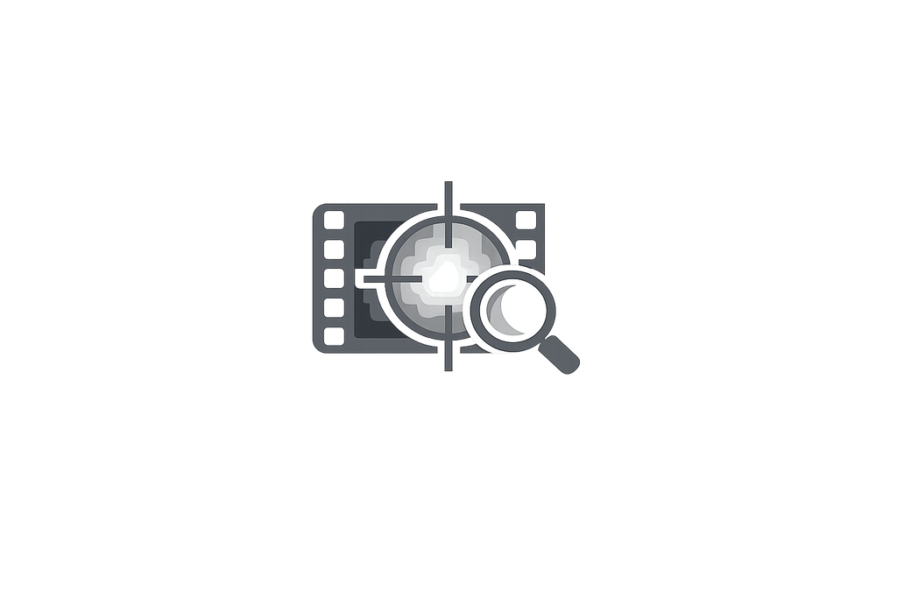
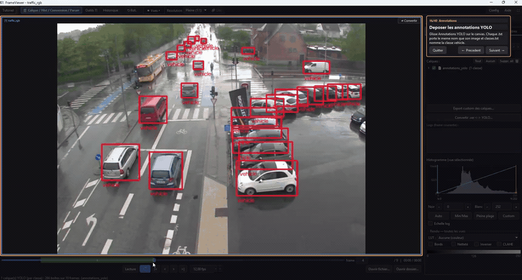

# FrameViewer

FrameViewer is a local desktop application for inspecting image sequences,
videos and raw YUV streams. It provides synchronized multi-view navigation,
contrast and LUT controls, annotations, regions of interest, frame extraction,
conversion tools and a documented Python plugin API.

<p align="center">
  
</p>



## What FrameViewer does

**FrameViewer is a visualization and rapid-review application.** Its primary
role is to display media and precomputed results clearly, compare them quickly
and export what the operator sees. Model training and inference orchestration
remain outside its core scope.

The application is designed around **multimodal inspection**: RGB, infrared,
thermal, grayscale, 8/16-bit imagery, videos, annotations and plugin-generated
results can be reviewed independently or combined in synchronized views.

The interface starts in French. Use the persistent `FR | ENG` control to
switch every application-owned screen, dialog and tutorial step to English.
Text and controls supplied by third-party or user plugins remain under the
plugin author's control.

| Area | Capabilities |
| --- | --- |
| **Media and navigation** | Open individual images, naturally ordered image folders, videos and raw YUV streams from the toolbar, command line or drag and drop. Scrub the timeline, enter a frame number, step frame by frame, play, loop, control audio and monitor the effective frame rate. |
| **Multimodal multi-view** | Display one to four heterogeneous sources in single, side-by-side, stacked, three-column or 2x2 layouts. Use temporal comparison or alpha fusion, keep views independent, or link frame navigation, zoom and pan with per-view starting offsets and safe common playback limits. |
| **Display pipeline** | Apply per-view black/white windowing, automatic, min/max, full-range or fixed contrast, built-in color maps, custom 3D LUTs, CLAHE, sharpening, edge detection, inversion and 90-degree rotation. Select a reduced display resolution for heavy or remote datasets without changing the source data. |
| **Inspection and measurement** | Zoom, pan and auto-fit precisely. Draw a ROI and inspect its crop, histogram, minimum, maximum, mean, standard deviation and median. Compute a 2D FFT, export a line profile, measure distance and angle, compare frames temporally and use a configurable crosshair. |
| **Results and annotations** | Load YOLO folders, merged YOLO text files and tracked-box files. Match labels by image name, manage classes and tracks, inspect annotation counts, show or hide individual layers, follow a tracked box with a ROI and convert between supported annotation layouts. |
| **Capture and export** | Capture the displayed frame, record image clicks to text, undo or clear clicks, define IN/OUT ranges, assemble multiple extraction segments and export clips or image sequences. Export raw 16-bit data when available or bake contrast, LUTs, filters, annotations and plugin overlays exactly as displayed. |
| **Multiview export** | Export the complete synchronized composition, including layouts, multimodal sources, temporal offsets and inter-view overlays, to a shareable video or image result. |
| **Plugin platform** | Discover code or graph plugins from application and user directories. Assign data by drag and drop, render shapes, patches and inter-view links, expose dock panels and actions, inspect isolated logs, reload plugins, and create or edit plugins from the built-in tools. |
| **Professional workflow** | Background loading and prefetching keep the interface responsive. User settings, layouts, rendering choices and plugin configuration are isolated in a writable profile. The application works locally and offline and can be rebuilt as standalone Windows, Linux x64 and Linux ARM64 packages. |
| **Guided onboarding** | A 40-step interactive tutorial uses bundled RGB, thermal, YOLO and multiview examples to exercise the real controls, including drag and drop, LUTs, exports, linked views and both demonstration plugins. |


## Run from source

Requirements: Windows or Linux, Python 3.12 and a working C/C++ runtime for
the binary Python wheels.

```powershell
python -m venv .venv
.\.venv\Scripts\python.exe -m pip install --upgrade pip
.\.venv\Scripts\python.exe -m pip install -r requirements.txt
.\.venv\Scripts\python.exe main.py
```

Linux:

```bash
python3.12 -m venv .venv
./.venv/bin/python -m pip install --upgrade pip
./.venv/bin/python -m pip install -r requirements.txt
./.venv/bin/python main.py
```

Files and folders can be opened from the toolbar, by drag and drop, or as a
positional command-line argument.

## Interactive tutorial

`Tutoriel`, the first toolbar button, starts a 40-step action-driven tour using
the included RGB, thermal, YOLO and multi-view CSV examples. The seed data is
copied to the current user's writable configuration directory before each run.
The orange reminder disappears only after the final step and the tutorial
remains available afterward. Demonstration plugins always start inactive and
their CSV inputs must be supplied explicitly by drag and drop; neither their
activation nor their input paths are persisted.

The `Lier` dialog assigns one starting frame to every visible view. Linked
navigation preserves these offsets during scrubbing, stepping and playback,
and synchronizes zoom and pan. Examples: `[10, 0]` for stacked views and
`[17, 8, 0, 0]` for a 2x2 grid.

## Rebuild the standalone application

The published repository intentionally contains no executable and no vendored
virtual environment. Install the requirements, then run:

```powershell
.\.venv\Scripts\python.exe rebuild_standalone.py
```

The generated application and the two demonstration plugins are written to
`release/`. Use `python rebuild_standalone.py --check` for a fast environment
and source validation without creating an executable.

## Plugins included

- `plugins_demo_showcase`: overview of the public plugin API.
- `plugins_demo_2_multivue_kpts`: synchronized multi-view keypoint example.

Each plugin is loaded from the `plugins/` directory next to the source tree or
next to the standalone executable. See `plugins/PLUGIN_API.md` for the API.

## Repository contents

- `frameviewer/core`: media sources and image processing.
- `frameviewer/workers`: background loading and conversion tasks.
- `frameviewer/ui`: PySide6 interface.
- `frameviewer/plugins`: plugin loader and public API.
- `frameviewer/test_pytest`: themed backend, frontend and integration tests.
- `plugins`: the two demonstration plugins.
- `data_test`: writable tutorial seeds (RGB, IR, annotations and plugin CSVs).
- `rebuild_standalone.py`: reproducible PyInstaller build entry point.

## Tests

```powershell
python -m pip install -r requirements-dev.txt
python run_all_tests.py
python rebuild_standalone.py --check
```

## License

Original FrameViewer code is available under
[`AGPL-3.0-only`](LICENSE). Network use of a modified version is covered by the
AGPL source-availability requirements. Organizations that need proprietary
terms can request a separate commercial license; see
[`COMMERCIAL_LICENSE.md`](COMMERCIAL_LICENSE.md).

Third-party software and tutorial data retain their own terms. See
[`THIRD_PARTY_LICENSES.md`](THIRD_PARTY_LICENSES.md) and
[`data_test/ATTRIBUTION.md`](data_test/ATTRIBUTION.md).
